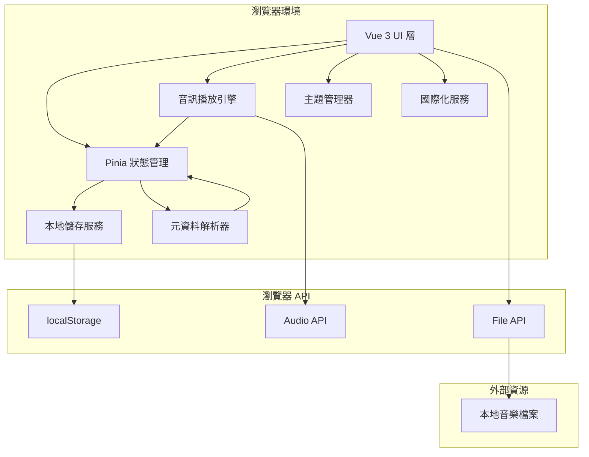
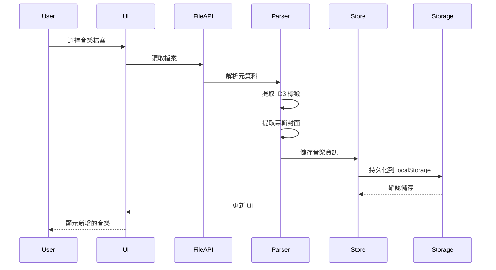
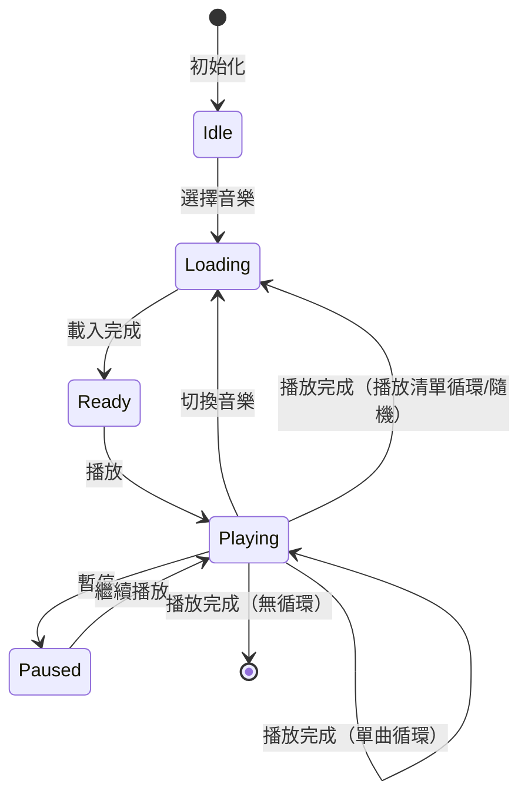

# 設計文件

## 概述

本地音樂播放器是一個基於 Vue 3 的單頁應用程式（SPA），使用 Composition API 和 PrimeVue UI 元件庫構建。應用程式完全在客戶端運行，使用瀏覽器的 File API 讀取本地音樂檔案，並使用 Web Audio API 進行播放控制。所有資料（播放清單、收藏、偏好設定）都儲存在瀏覽器的 localStorage 中。

### 核心特性

- **零後端依賴**：完全在瀏覽器中運行，無需伺服器
- **檔案系統整合**：使用 File API 和 FileReader API 讀取本地音樂檔案
- **音訊處理**：使用 HTML5 Audio API 進行播放控制
- **元資料解析**：使用 jsmediatags 函式庫解析 ID3 標籤
- **響應式狀態管理**：使用 Vue 3 Composition API 和 Pinia 狀態管理
- **持久化儲存**：使用 localStorage 儲存所有應用程式狀態
- **國際化**：使用 vue-i18n 支援繁體中文和英文

## 架構

### 系統架構圖



### 分層架構

1. **展示層（Presentation Layer）**
   - Vue 3 元件
   - PrimeVue UI 元件
   - 磨砂玻璃樣式系統
   - 響應式佈局

2. **業務邏輯層（Business Logic Layer）**
   - Pinia stores（音樂庫、播放器、播放清單、使用者偏好）
   - 播放模式邏輯（順序、循環、隨機）
   - 搜尋和過濾邏輯
   - 分類邏輯（藝術家、專輯）

3. **服務層（Service Layer）**
   - 音訊播放服務
   - 元資料解析服務
   - 本地儲存服務
   - 主題管理服務
   - 顏色提取服務

4. **資料層（Data Layer）**
   - localStorage 介面
   - 檔案讀取介面

## 元件和介面

### 核心元件結構

```
src/
├── App.vue                      # 根元件
├── main.js                      # 應用程式入口
├── components/
│   ├── layout/
│   │   ├── AppHeader.vue       # 頂部導航列
│   │   ├── AppSidebar.vue      # 側邊欄（播放清單、分類）
│   │   └── AppPlayer.vue       # 底部播放器控制列
│   ├── music/
│   │   ├── MusicList.vue       # 音樂清單
│   │   ├── MusicItem.vue       # 音樂項目
│   │   ├── MusicInfo.vue       # 音樂資訊對話框
│   │   └── AlbumCover.vue      # 專輯封面元件
│   ├── playlist/
│   │   ├── PlaylistList.vue    # 播放清單列表
│   │   ├── PlaylistItem.vue    # 播放清單項目
│   │   ├── PlaylistDialog.vue  # 建立/編輯播放清單對話框
│   │   └── PlaylistImportExport.vue # 導入/匯出功能
│   ├── search/
│   │   └── SearchBar.vue       # 搜尋列
│   ├── settings/
│   │   ├── ThemeToggle.vue     # 主題切換
│   │   ├── LanguageToggle.vue  # 語言切換
│   │   └── SettingsPanel.vue   # 設定面板
│   └── common/
│       ├── FileUploader.vue    # 檔案上傳元件
│       └── LoadingSpinner.vue  # 載入動畫
├── stores/
│   ├── musicLibrary.js         # 音樂庫狀態
│   ├── player.js               # 播放器狀態
│   ├── playlist.js             # 播放清單狀態
│   └── preferences.js          # 使用者偏好設定
├── services/
│   ├── audioService.js         # 音訊播放服務
│   ├── metadataService.js      # 元資料解析服務
│   ├── storageService.js       # 本地儲存服務
│   ├── themeService.js         # 主題管理服務
│   └── colorExtractor.js       # 顏色提取服務
├── composables/
│   ├── useAudioPlayer.js       # 音訊播放器組合式函數
│   ├── useKeyboardShortcuts.js # 鍵盤快捷鍵組合式函數
│   ├── useFuzzySearch.js       # 模糊搜尋組合式函數
│   └── useTheme.js             # 主題組合式函數
├── utils/
│   ├── fileUtils.js            # 檔案處理工具
│   ├── formatUtils.js          # 格式化工具
│   └── validators.js           # 驗證工具
├── i18n/
│   ├── index.js                # i18n 配置
│   ├── zh-TW.json              # 繁體中文翻譯
│   └── en.json                 # 英文翻譯
└── styles/
    ├── variables.css           # CSS 變數
    ├── theme-dark.css          # 暗色主題
    ├── theme-light.css         # 亮色主題
    └── glassmorphism.css       # 磨砂玻璃效果
```

### 主要介面定義

#### 音樂檔案介面

```javascript
// MusicFile 介面
{
  id: string,              // 唯一識別碼（UUID）
  file: File,              // 原始 File 物件（不儲存到 localStorage）
  fileHandle: string,      // 檔案參考（用於重新載入）
  title: string,           // 歌曲標題
  artist: string,          // 藝術家
  album: string,           // 專輯名稱
  duration: number,        // 時長（秒）
  fileSize: number,        // 檔案大小（位元組）
  format: string,          // 檔案格式（mp3, flac, wav 等）
  coverArt: string | null, // 專輯封面（base64 或 blob URL）
  liked: boolean,          // 是否收藏
  addedAt: number,         // 加入時間戳
  lastPlayedAt: number | null // 最後播放時間戳
}
```

#### 播放清單介面

```javascript
// Playlist 介面
{
  id: string,              // 唯一識別碼（UUID）
  name: string,            // 播放清單名稱
  description: string,     // 描述
  musicIds: string[],      // 音樂檔案 ID 陣列
  coverArt: string | null, // 播放清單封面（使用第一首歌的封面）
  createdAt: number,       // 建立時間戳
  updatedAt: number        // 更新時間戳
}
```

#### 播放器狀態介面

```javascript
// PlayerState 介面
{
  currentMusicId: string | null,  // 當前播放的音樂 ID
  isPlaying: boolean,              // 是否正在播放
  currentTime: number,             // 當前播放時間（秒）
  volume: number,                  // 音量（0-1）
  playMode: 'sequential' | 'repeat-one' | 'repeat-all' | 'shuffle', // 播放模式
  queue: string[],                 // 播放佇列（音樂 ID 陣列）
  queueIndex: number,              // 當前佇列索引
  shuffleQueue: string[] | null    // 隨機播放佇列
}
```

#### 使用者偏好設定介面

```javascript
// UserPreferences 介面
{
  theme: 'dark' | 'light',         // 主題
  language: 'zh-TW' | 'en',        // 語言
  adaptiveColor: boolean,          // 是否啟用適應性配色
  categorizeView: boolean,         // 是否啟用分類檢視
  volume: number,                  // 預設音量
  playMode: string                 // 預設播放模式
}
```

### Pinia Stores

#### Music Library Store

```javascript
// stores/musicLibrary.js
export const useMusicLibraryStore = defineStore('musicLibrary', {
  state: () => ({
    music: [],              // MusicFile[]
    artists: {},            // { [artist: string]: MusicFile[] }
    albums: {},             // { [album: string]: MusicFile[] }
    likedMusic: [],         // string[] (music IDs)
    isLoading: false
  }),
  
  getters: {
    getMusicById: (state) => (id) => state.music.find(m => m.id === id),
    getLikedMusic: (state) => state.music.filter(m => state.likedMusic.includes(m.id)),
    getArtists: (state) => Object.keys(state.artists).sort(),
    getAlbums: (state) => Object.keys(state.albums).sort(),
    getMusicByArtist: (state) => (artist) => state.artists[artist] || [],
    getMusicByAlbum: (state) => (album) => state.albums[album] || []
  },
  
  actions: {
    async addMusic(files),
    removeMusic(id),
    toggleLike(id),
    categorizeMusic(),
    loadFromStorage(),
    saveToStorage()
  }
})
```

#### Player Store

```javascript
// stores/player.js
export const usePlayerStore = defineStore('player', {
  state: () => ({
    currentMusicId: null,
    isPlaying: false,
    currentTime: 0,
    volume: 0.7,
    playMode: 'sequential',
    queue: [],
    queueIndex: -1,
    shuffleQueue: null
  }),
  
  getters: {
    currentMusic: (state) => {
      const library = useMusicLibraryStore()
      return library.getMusicById(state.currentMusicId)
    },
    hasNext: (state) => state.queueIndex < state.queue.length - 1,
    hasPrevious: (state) => state.queueIndex > 0
  },
  
  actions: {
    play(musicId),
    pause(),
    togglePlayPause(),
    next(),
    previous(),
    seek(time),
    setVolume(volume),
    setPlayMode(mode),
    setQueue(musicIds),
    shuffleQueue(),
    loadFromStorage(),
    saveToStorage()
  }
})
```

#### Playlist Store

```javascript
// stores/playlist.js
export const usePlaylistStore = defineStore('playlist', {
  state: () => ({
    playlists: []  // Playlist[]
  }),
  
  getters: {
    getPlaylistById: (state) => (id) => state.playlists.find(p => p.id === id),
    getPlaylistsContainingMusic: (state) => (musicId) => 
      state.playlists.filter(p => p.musicIds.includes(musicId))
  },
  
  actions: {
    createPlaylist(name, description),
    deletePlaylist(id),
    updatePlaylist(id, updates),
    addMusicToPlaylist(playlistId, musicId),
    removeMusicFromPlaylist(playlistId, musicId),
    reorderPlaylist(playlistId, oldIndex, newIndex),
    exportPlaylist(id),
    importPlaylist(jsonData),
    loadFromStorage(),
    saveToStorage()
  }
})
```

#### Preferences Store

```javascript
// stores/preferences.js
export const usePreferencesStore = defineStore('preferences', {
  state: () => ({
    theme: 'dark',
    language: 'zh-TW',
    adaptiveColor: true,
    categorizeView: false,
    volume: 0.7,
    playMode: 'sequential'
  }),
  
  actions: {
    setTheme(theme),
    setLanguage(language),
    toggleAdaptiveColor(),
    toggleCategorizeView(),
    loadFromStorage(),
    saveToStorage()
  }
})
```

## 資料模型

### 本地儲存結構

由於瀏覽器的 localStorage 有大小限制（通常 5-10MB），我們需要謹慎設計儲存策略：

```javascript
// localStorage 鍵值結構
{
  'music-player:music-library': {
    music: [
      {
        id: string,
        // 不儲存 File 物件和 coverArt（太大）
        title: string,
        artist: string,
        album: string,
        duration: number,
        fileSize: number,
        format: string,
        liked: boolean,
        addedAt: number,
        lastPlayedAt: number | null
      }
    ]
  },
  
  'music-player:playlists': {
    playlists: [Playlist]
  },
  
  'music-player:player-state': {
    currentMusicId: string | null,
    volume: number,
    playMode: string,
    queue: string[],
    queueIndex: number
  },
  
  'music-player:preferences': UserPreferences,
  
  // 專輯封面單獨儲存（使用 IndexedDB 更好）
  'music-player:covers': {
    [musicId]: base64String
  }
}
```

### 檔案處理流程



### 播放流程



## 正確性屬性

*屬性（Property）是一個特徵或行為，應該在系統的所有有效執行中保持為真——本質上是關於系統應該做什麼的正式陳述。屬性作為人類可讀規範和機器可驗證正確性保證之間的橋樑。*


### 屬性反思

在分析所有驗收標準後，我識別出以下可以合併或簡化的屬性：

**持久化相關屬性的合併：**
- 需求 1.3、2.10、3.9、4.4、8.5、9.6、10.3、12.3、15.1-15.4 都涉及將資料儲存到 localStorage
- 這些可以合併為一個通用的「狀態變更持久化」屬性

**往返屬性的識別：**
- 需求 1.3 + 1.5（音樂庫持久化往返）
- 需求 3.6 + 3.7（播放清單匯出/導入往返）
- 需求 4.1 + 4.2（收藏切換往返）
- 需求 10.3 + 10.4（主題持久化往返）
- 需求 12.3 + 12.4（語言持久化往返）
- 需求 15.1-15.4 + 15.5（完整資料持久化往返）

**播放控制的合併：**
- 需求 2.3、2.4、14.2、14.3 都涉及播放清單導航
- 可以合併為一個「播放清單導航」屬性

**UI 樣式屬性的合併：**
- 需求 11.1、11.2、11.4 都涉及磨砂玻璃效果的 CSS 屬性
- 可以合併為一個「磨砂玻璃樣式應用」屬性

**鍵盤快捷鍵的合併：**
- 需求 14.1-14.8 可以合併為幾個通用的「鍵盤快捷鍵映射」屬性

經過反思，我將從 80+ 個可測試標準中提煉出約 30-35 個獨特且有價值的正確性屬性。

### 正確性屬性

#### 屬性 1：音樂檔案載入完整性
*對於任何*有效的音樂檔案集合，當載入到播放器時，音樂庫應該包含所有這些檔案，且每個檔案都有正確解析的元資料（標題、藝術家、專輯、時長）。
**驗證需求：1.1, 1.2**

#### 屬性 2：不支援格式拒絕
*對於任何*不支援的檔案格式，系統應該拒絕該檔案並顯示錯誤訊息，且音樂庫不應包含該檔案。
**驗證需求：1.4**

#### 屬性 3：音樂庫持久化往返
*對於任何*音樂庫狀態，將其儲存到 localStorage 然後重新載入，應該得到等價的音樂庫狀態（包含相同的音樂檔案和元資料）。
**驗證需求：1.3, 1.5**

#### 屬性 4：播放狀態切換
*對於任何*播放器狀態，當執行播放/暫停操作時，播放狀態應該在「播放中」和「已暫停」之間正確切換。
**驗證需求：2.1, 2.2, 14.1**

#### 屬性 5：播放清單導航
*對於任何*非空播放清單和有效的當前索引，當執行「下一首」操作時，當前索引應該增加（或在最後一首時根據播放模式處理）；當執行「上一首」操作時，當前索引應該減少（或在第一首時保持不變）。
**驗證需求：2.3, 2.4, 14.2, 14.3**

#### 屬性 6：播放位置控制
*對於任何*有效的時間位置（0 到音樂時長之間），當設定播放位置時，播放器的當前時間應該更新為該位置。
**驗證需求：2.5**

#### 屬性 7：音量控制範圍
*對於任何*音量調整操作，播放器的音量應該保持在 0 到 1 的範圍內，且音量變更應該正確反映在播放器狀態中。
**驗證需求：2.6, 14.4, 14.5**

#### 屬性 8：單曲循環行為
*對於任何*音樂，當播放模式設為「單曲循環」且該音樂播放完畢時，系統應該重新播放同一首音樂。
**驗證需求：2.7**

#### 屬性 9：播放清單循環行為
*對於任何*播放清單，當播放模式設為「播放清單循環」且播放到最後一首完畢時，系統應該從第一首重新開始播放。
**驗證需求：2.8**

#### 屬性 10：隨機播放包含性
*對於任何*播放清單，當播放模式設為「隨機播放」時，隨機播放佇列應該包含播放清單中的所有音樂（但順序不同）。
**驗證需求：2.9**

#### 屬性 11：播放清單建立
*對於任何*有效的播放清單名稱，建立新播放清單後，播放清單集合應該包含該播放清單，且該播放清單應該為空。
**驗證需求：3.1**

#### 屬性 12：播放清單加入音樂
*對於任何*播放清單和音樂檔案，將音樂加入播放清單後，該播放清單應該包含該音樂，且播放清單長度應該增加 1。
**驗證需求：3.2**

#### 屬性 13：播放清單移除音樂保留原檔
*對於任何*播放清單和其中的音樂，從播放清單中移除音樂後，該播放清單不應包含該音樂，但音樂庫仍應包含該音樂檔案。
**驗證需求：3.3**

#### 屬性 14：刪除播放清單保留音樂
*對於任何*播放清單，刪除播放清單後，播放清單集合不應包含該播放清單，但播放清單中的所有音樂檔案仍應存在於音樂庫中。
**驗證需求：3.4**

#### 屬性 15：播放清單排序更新
*對於任何*播放清單和有效的重新排序操作，執行排序後，播放清單中的音樂順序應該反映新的排序。
**驗證需求：3.5**

#### 屬性 16：播放清單匯出/導入往返
*對於任何*播放清單，將其匯出為 JSON 然後導入，應該得到等價的播放清單（包含相同的名稱、音樂和順序）。
**驗證需求：3.6, 3.7**

#### 屬性 17：無效 JSON 拒絕
*對於任何*格式不正確的 JSON 檔案，系統應該拒絕導入並顯示錯誤訊息，且不應建立新的播放清單。
**驗證需求：3.8**

#### 屬性 18：收藏切換往返
*對於任何*音樂，連續兩次切換收藏狀態應該回到原始狀態（收藏然後取消收藏，或取消收藏然後收藏）。
**驗證需求：4.1, 4.2**

#### 屬性 19：收藏清單過濾
*對於任何*音樂庫狀態，收藏清單應該只包含收藏狀態為 true 的音樂，且應該包含所有這樣的音樂。
**驗證需求：4.3**

#### 屬性 20：搜尋結果匹配
*對於任何*搜尋關鍵字，搜尋結果中的每首音樂的標題、藝術家或專輯名稱應該包含該關鍵字（支援模糊匹配）。
**驗證需求：5.1, 5.2, 5.3**

#### 屬性 21：清除搜尋顯示全部
*對於任何*音樂庫狀態，當搜尋關鍵字為空時，顯示的音樂清單應該包含音樂庫中的所有音樂。
**驗證需求：5.5**

#### 屬性 22：檔案資訊完整性
*對於任何*音樂檔案，顯示的檔案資訊應該包含標題、藝術家、專輯、時長、檔案大小和格式等所有必要欄位。
**驗證需求：6.2**

#### 屬性 23：專輯封面提取
*對於任何*包含嵌入專輯封面的音樂檔案，系統應該正確提取並顯示該封面；對於不包含封面的檔案，應該顯示預設佔位圖片。
**驗證需求：7.1, 7.3**

#### 屬性 24：適應性配色更新
*對於任何*音樂，當適應性配色功能啟用且播放該音樂時，播放器介面的強調色應該更新為該音樂專輯封面的主要顏色。
**驗證需求：8.1, 8.2, 8.3**

#### 屬性 25：停用適應性配色使用預設
*對於任何*播放器狀態，當適應性配色功能停用時，播放器介面應該使用預設的主題配色，而不是專輯封面的顏色。
**驗證需求：8.4**

#### 屬性 26：藝術家分組正確性
*對於任何*音樂庫，按藝術家分組後，每個分組應該只包含該藝術家的音樂，且所有音樂都應該被分配到某個分組中。
**驗證需求：9.1**

#### 屬性 27：專輯分組正確性
*對於任何*音樂庫，按專輯分組後，每個分組應該只包含該專輯的音樂，且所有音樂都應該被分配到某個分組中。
**驗證需求：9.2**

#### 屬性 28：分類檢視切換
*對於任何*音樂庫狀態，當啟用分類檢視時應該顯示分組清單，當停用時應該顯示平面清單，且兩種檢視應該包含相同的音樂集合。
**驗證需求：9.3, 9.4**

#### 屬性 29：主題切換往返
*對於任何*主題設定，將其儲存到 localStorage 然後重新載入應用程式，應該恢復相同的主題設定。
**驗證需求：10.3, 10.4**

#### 屬性 30：磨砂玻璃樣式應用
*對於任何*需要磨砂玻璃效果的 UI 元件（卡片、面板、播放器控制項），應該應用正確的 CSS 屬性（backdrop-filter、半透明背景）。
**驗證需求：11.1, 11.2, 11.4**

#### 屬性 31：語言切換更新文字
*對於任何*語言設定（繁體中文或英文），當切換語言時，所有介面文字應該更新為該語言的翻譯。
**驗證需求：12.1, 12.2**

#### 屬性 32：語言持久化往返
*對於任何*語言設定，將其儲存到 localStorage 然後重新載入應用程式，應該恢復相同的語言設定。
**驗證需求：12.3, 12.4**

#### 屬性 33：鍵盤快捷鍵映射正確性
*對於任何*鍵盤快捷鍵（空白鍵、方向鍵、L、S、R），當不在輸入框中時，按下該鍵應該觸發對應的操作（播放/暫停、導航、收藏、搜尋、切換模式）。
**驗證需求：14.1, 14.2, 14.3, 14.4, 14.5, 14.6, 14.7, 14.8**

#### 屬性 34：輸入框中停用快捷鍵
*對於任何*輸入框，當焦點在輸入框中時，播放控制快捷鍵（空白鍵、方向鍵）不應該觸發播放器操作。
**驗證需求：14.9**

#### 屬性 35：完整資料持久化往返
*對於任何*應用程式狀態（包含音樂庫、播放清單、收藏狀態、使用者偏好設定），將其儲存到 localStorage 然後重新載入應用程式，應該恢復等價的應用程式狀態。
**驗證需求：15.1, 15.2, 15.3, 15.4, 15.5**

#### 屬性 36：損壞資料處理
*對於任何*損壞的 localStorage 資料，系統應該顯示錯誤訊息並初始化為預設狀態，而不是崩潰或顯示不正確的資料。
**驗證需求：15.6**

## 錯誤處理

### 檔案處理錯誤

1. **不支援的檔案格式**
   - 檢測：檢查檔案副檔名和 MIME 類型
   - 處理：顯示錯誤訊息「不支援的檔案格式：{format}」
   - 恢復：拒絕該檔案，繼續處理其他檔案

2. **檔案讀取失敗**
   - 檢測：FileReader API 錯誤事件
   - 處理：顯示錯誤訊息「無法讀取檔案：{filename}」
   - 恢復：跳過該檔案，繼續處理其他檔案

3. **元資料解析失敗**
   - 檢測：jsmediatags 解析錯誤
   - 處理：使用檔案名稱作為標題，顯示警告
   - 恢復：仍然加入音樂庫，但元資料不完整

### 播放錯誤

1. **音訊載入失敗**
   - 檢測：Audio 元素的 error 事件
   - 處理：顯示錯誤訊息「無法播放：{title}」
   - 恢復：自動跳到下一首

2. **播放中斷**
   - 檢測：Audio 元素的 stalled 或 suspend 事件
   - 處理：顯示載入指示器
   - 恢復：等待恢復或超時後跳過

### 儲存錯誤

1. **localStorage 已滿**
   - 檢測：QuotaExceededError 異常
   - 處理：顯示錯誤訊息「儲存空間不足，請清理部分資料」
   - 恢復：提供清理選項（刪除舊的音樂、播放清單）

2. **localStorage 不可用**
   - 檢測：localStorage 訪問異常
   - 處理：顯示警告「無法儲存資料，設定將不會保留」
   - 恢復：繼續運行但不持久化

3. **資料損壞**
   - 檢測：JSON 解析錯誤或資料驗證失敗
   - 處理：顯示錯誤訊息「資料已損壞，將重置為預設狀態」
   - 恢復：清除損壞的資料，初始化為預設狀態

### 導入/匯出錯誤

1. **JSON 格式錯誤**
   - 檢測：JSON.parse 異常
   - 處理：顯示錯誤訊息「無效的播放清單檔案」
   - 恢復：拒絕導入，保持當前狀態

2. **播放清單資料不完整**
   - 檢測：缺少必要欄位（name、musicIds）
   - 處理：顯示錯誤訊息「播放清單資料不完整」
   - 恢復：拒絕導入，保持當前狀態

### 錯誤處理原則

1. **優雅降級**：錯誤不應導致整個應用程式崩潰
2. **明確訊息**：錯誤訊息應該清楚說明問題和可能的解決方案
3. **自動恢復**：盡可能自動恢復到可用狀態
4. **使用者控制**：提供使用者選項來處理錯誤（重試、跳過、清理）
5. **日誌記錄**：在開發模式下記錄詳細錯誤資訊

## 測試策略

### 雙重測試方法

本專案採用單元測試和屬性測試相結合的方法，以確保全面的測試覆蓋率：

- **單元測試**：驗證特定範例、邊界情況和錯誤條件
- **屬性測試**：驗證所有輸入的通用屬性
- 兩者互補且都是必要的

### 單元測試策略

單元測試應該專注於：
- **特定範例**：展示正確行為的具體案例
- **整合點**：元件之間的互動
- **邊界情況**：空清單、單一項目、最大值
- **錯誤條件**：無效輸入、網路錯誤、儲存失敗

避免編寫過多的單元測試 - 屬性測試會處理大量輸入的覆蓋。

### 屬性測試策略

**測試框架**：使用 **fast-check** 進行 JavaScript 的屬性測試

**配置要求**：
- 每個屬性測試最少 100 次迭代（由於隨機化）
- 每個測試必須引用其設計文件屬性
- 標籤格式：**Feature: local-music-player, Property {number}: {property_text}**

**屬性測試範例**：

```javascript
import fc from 'fast-check'
import { describe, it, expect } from 'vitest'

describe('Feature: local-music-player, Property 3: 音樂庫持久化往返', () => {
  it('儲存然後載入音樂庫應該得到等價的狀態', () => {
    fc.assert(
      fc.property(
        fc.array(musicFileArbitrary()),
        (musicFiles) => {
          // 建立音樂庫
          const library = createMusicLibrary(musicFiles)
          
          // 儲存到 localStorage
          saveToStorage(library)
          
          // 從 localStorage 載入
          const loadedLibrary = loadFromStorage()
          
          // 驗證等價性
          expect(loadedLibrary.music).toHaveLength(musicFiles.length)
          expect(loadedLibrary.music).toEqual(
            expect.arrayContaining(
              musicFiles.map(f => expect.objectContaining({
                title: f.title,
                artist: f.artist,
                album: f.album
              }))
            )
          )
        }
      ),
      { numRuns: 100 }
    )
  })
})
```

### 測試覆蓋範圍

#### 核心功能測試

1. **音樂庫管理**
   - 單元測試：加入單一檔案、加入多個檔案、移除檔案
   - 屬性測試：屬性 1（載入完整性）、屬性 2（格式拒絕）、屬性 3（持久化往返）

2. **播放器控制**
   - 單元測試：播放第一首、播放最後一首、空清單處理
   - 屬性測試：屬性 4（播放切換）、屬性 5（導航）、屬性 6（位置控制）、屬性 7（音量控制）

3. **播放模式**
   - 單元測試：每種模式的特定行為
   - 屬性測試：屬性 8（單曲循環）、屬性 9（清單循環）、屬性 10（隨機播放）

4. **播放清單管理**
   - 單元測試：建立空清單、刪除不存在的清單
   - 屬性測試：屬性 11-17（播放清單操作和往返）

5. **收藏功能**
   - 單元測試：收藏單一音樂、收藏多個音樂
   - 屬性測試：屬性 18（切換往返）、屬性 19（過濾）

6. **搜尋功能**
   - 單元測試：搜尋特定關鍵字、空搜尋結果
   - 屬性測試：屬性 20（匹配）、屬性 21（清除顯示全部）

7. **分類功能**
   - 單元測試：單一藝術家、多個藝術家
   - 屬性測試：屬性 26（藝術家分組）、屬性 27（專輯分組）、屬性 28（檢視切換）

8. **主題和語言**
   - 單元測試：切換到特定主題/語言
   - 屬性測試：屬性 29（主題往返）、屬性 31-32（語言切換和往返）

9. **鍵盤快捷鍵**
   - 單元測試：每個快捷鍵的特定行為
   - 屬性測試：屬性 33（映射正確性）、屬性 34（輸入框停用）

10. **資料持久化**
    - 單元測試：儲存空狀態、載入不存在的資料
    - 屬性測試：屬性 35（完整往返）、屬性 36（損壞處理）

### 測試工具和框架

- **測試執行器**：Vitest
- **屬性測試**：fast-check
- **元件測試**：@vue/test-utils
- **模擬**：vi (Vitest 內建)
- **覆蓋率**：Vitest coverage (c8)

### 測試環境設定

```javascript
// vitest.config.js
import { defineConfig } from 'vitest/config'
import vue from '@vitejs/plugin-vue'

export default defineConfig({
  plugins: [vue()],
  test: {
    environment: 'jsdom',
    coverage: {
      provider: 'c8',
      reporter: ['text', 'json', 'html'],
      exclude: [
        'node_modules/',
        'src/main.js',
        '**/*.spec.js'
      ]
    }
  }
})
```

### 持續整合

- 在每次提交時執行所有測試
- 要求最低 80% 的程式碼覆蓋率
- 屬性測試應該在 CI 中執行更多迭代（例如 1000 次）
